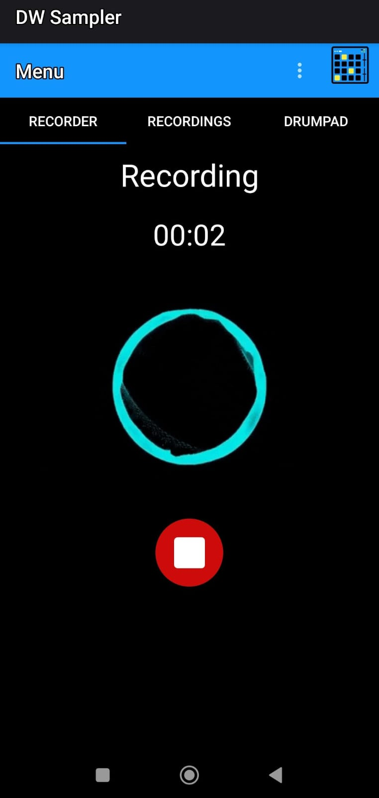
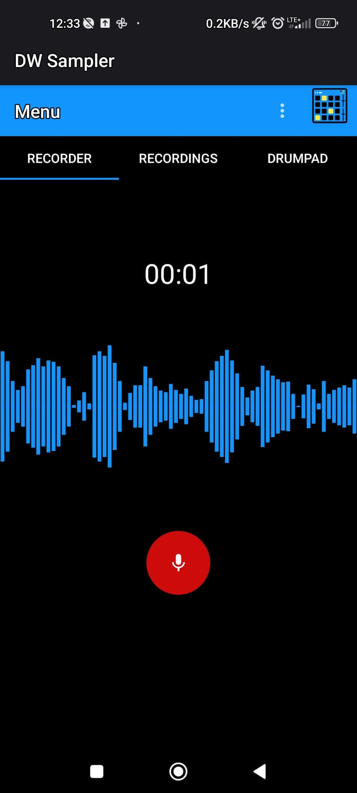
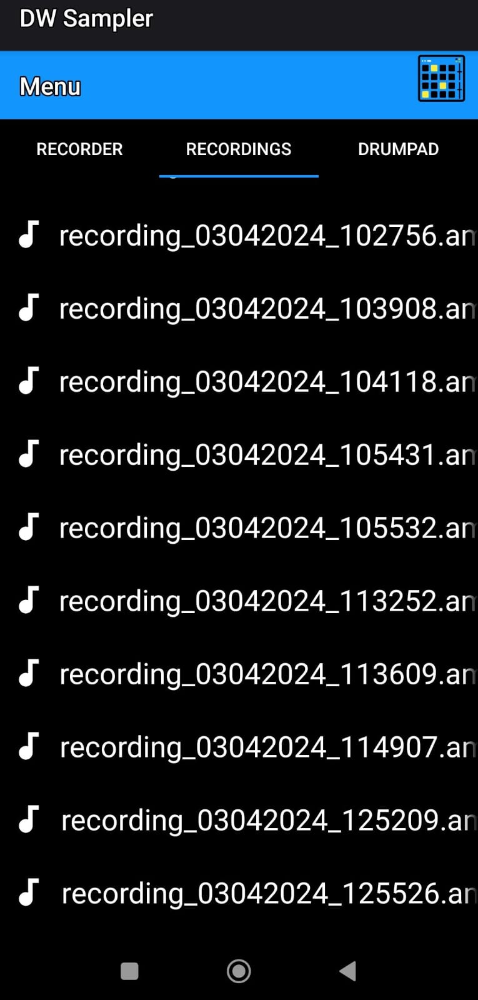
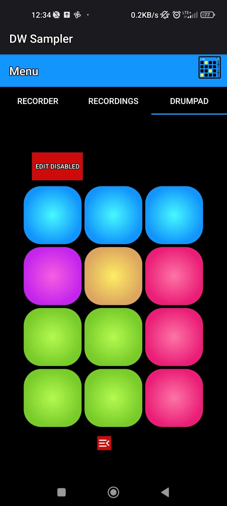

🎵 AudioRecorderApp
AudioRecorderApp is an Android application that allows users to record, edit, and play audio samples using a built-in drumpad. It turns your phone into a basic portable audio workstation and music instrument.

✨ Features
🎙️ Record high-quality audio from your microphone

✂️ Trim and edit recordings directly in the app

🥁 Assign edited samples to drumpads

🎼 Use the drumpad interface to play rhythms and melodies

💾 Save and reuse your custom audio samples

🚀 Getting Started
Clone the repo:

bash
Copy
Edit
git clone https://github.com/DiegoJimenezTamame/AudioRecorderApp.git
Open the project in Android Studio

Build and run on an Android device or emulator

📱 Requirements
Android 5.0 (API level 21) or higher

Microphone access permission

Storage permission (for saving recordings)

📸 Screenshots
<p float="left"> 
   
  
   
   
</p> ```

