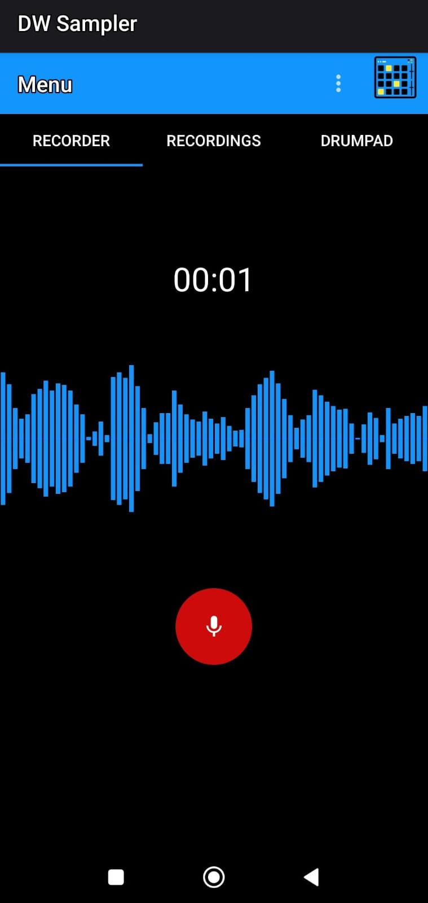

# 🔊 AudioRecorderApp

**AudioRecorderApp** is an Android application written in Java that lets users record, play, manage, and share audio recordings — and even **play them as musical samples** using a built-in **Drumpad** feature. Whether you're capturing voice notes or experimenting with sounds, this app bridges the gap between recording utility and creative expression.

> 🚧 This app is currently in development. Some features are experimental and not yet finalized.

---

## ✨ Features

- 🎙️ **Audio Recording** – Start, pause, and stop recordings with a simple interface
- ▶️ **Playback Controls** – Easily listen to your saved recordings
- 🗂️ **Recording Management** – Browse, delete, and rename recorded files
- 📤 **Sharing Support** – Share audio via messaging, email, or cloud storage
- 🎛️ **Drumpad Integration** – Load your recordings into a playable Drumpad to use them as musical samples (experimental)
- 📁 **File Storage** – Save recordings as `.wav` or `.mp3` (format subject to change)
- 📈 **Real-Time Visuals** – (Planned) Timer and waveform visualization
- 🔐 **Permissions Handling** – Runtime permissions for microphone and storage access

---

## 🛠 Tech Stack

- **Language**: Java
- **UI**: Android Views & XML Layouts
- **Audio**: `MediaRecorder`, `MediaPlayer`
- **Storage**: Internal/external file I/O
- **Architecture**: MVC/MVP (simple modular structure)
- **Drumpad**: Custom UI component for triggering audio samples
- **Permissions**: Android runtime permissions (`RECORD_AUDIO`, `WRITE_EXTERNAL_STORAGE`)

---

## 📦 Installation & Setup

1. Clone the repository:
   ```bash
   git clone https://github.com/DiegoJimenezTamame/AudioRecorderApp.git
   cd AudioRecorderApp
   ```

2. Open in **Android Studio** (Arctic Fox or newer)

3. Sync Gradle and resolve dependencies

4. Run on an emulator or physical device:
   ```bash
   ./gradlew installDebug
   ```

---

## 🔧 Usage Guide

1. **Grant Permissions** when prompted.
2. Tap the **Record button** to begin recording. Tap again to stop.
3. Access saved recordings in the **Recordings List**.
4. Tap to **play back**, **delete**, or **share** audio files.
5. Open the **Drumpad** interface to assign recorded samples to pads and trigger them musically.

---

## 🧪 Development Status

| Feature             | Status              |
|---------------------|---------------------|
| Audio Recording     | ✅ Functional        |
| Playback            | ✅ Functional        |
| Drumpad             | ⚠️ Experimental (basic pad playback) |
| Waveform Visualization | 🔜 Planned      |
| File Management     | ✅ Basic features done |
| Sharing             | ✅ Implemented      |
| Rename Support      | 🔜 Planned          |

---

📸 Screenshots
<p float="left"> 
   
  
   
   
</p>

---

## 🧩 How It Works

- **Recording**: Uses `MediaRecorder` to capture audio input
- **Playback**: Powered by `MediaPlayer` and Android’s native audio framework
- **Drumpad**: Maps recorded files to interactive pads, playable via touch input
- **Storage**: Files saved to app directory in device storage
- **Permissions**: Prompts for microphone and file access on first use

---

## 🤝 Contributing

We welcome contributions!

1. Fork the repository  
2. Create a branch:
   ```bash
   git checkout -b feature/your-feature-name
   ```
3. Make your changes  
4. Commit:
   ```bash
   git commit -m "feat: add new feature"
   ```
5. Push and open a Pull Request

Please open an issue to discuss major changes before starting work.

---

## 🚀 Roadmap

- [ ] Improve Drumpad responsiveness and UI
- [ ] Add waveform visualizer
- [ ] Add export/import options
- [ ] Implement dark mode
- [ ] Add multi-track recording (stretch goal)
- [ ] Settings panel (bitrate, format selection)

---

## 🛡 License

This project is licensed under the **MIT License**. See [LICENSE](LICENSE) for details.

---

## 👤 Author

**Diego Jimenez Tamame**  
📂 [GitHub](https://github.com/DiegoJimenezTamame)

---

## 🙏 Acknowledgements

- Android Audio APIs
- Android Developers
- Open-source community

---


